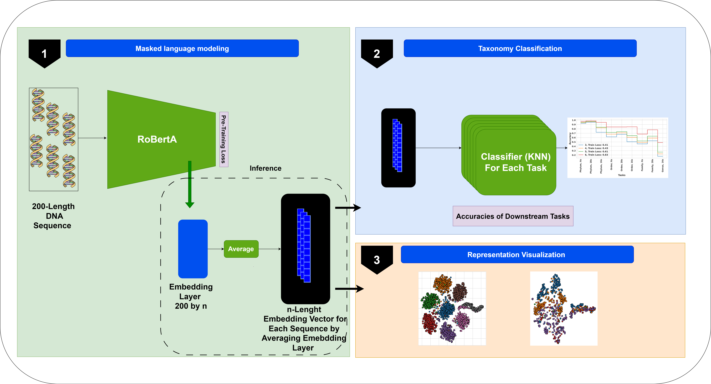

# MetaBERTa - Metagenomics Analysis with Language Models

MetaBerta is a project that enables metagenomics analysis using customizable language models. It provides a flexible pipeline that allows users to select their preferred architecture and language model (currently supporting BERT and Roberta) for training and analysis. The pipeline includes components for data preprocessing, model training, embedding generation, and evaluation.

## Pipeline Features

- **Customizable Language Models**: Users can choose between BERT and Roberta and BigBird architectures as their language model for metagenomics analysis. This flexibility allows for fine-tuning or transfer learning based on specific requirements.

- **Training**: The pipeline supports training the selected language model on metagenomic data. Users can provide their training data and specify the necessary hyperparameters to train the model.

- **Embedding**: MetaBerta allows users to generate embeddings for metagenomic sequences using the trained language model. These embeddings capture the semantic information of the sequences, enabling downstream analysis.

- **Evaluation**: The pipeline provides evaluation functionalities to assess the performance of the trained model on metagenomic tasks. Users can evaluate their model using various metrics, analyze the results, and visualize the performance.

- ## Requirements

To run MetaBerta, ensure you have the following dependencies:

- Hugging Face Transformers library: Install using `pip install transformers`.

Please ensure you have a compatible GPU and the necessary GPU drivers installed for accelerated processing.

## Citation:

@inproceedings{refahi2023leveraging,
  title={Leveraging Large Language Models for Metagenomic Analysis},
  author={Refahi, MS and Sokhansanj, BA and Rosen, GL},
  booktitle={2023 IEEE Signal Processing in Medicine and Biology Symposium (SPMB)},
  pages={1--6},
  year={2023},
  organization={IEEE}
}
